# 2주차 (2022-03-15)
- 안드로이드스튜디오설치 & 가입 및 레포지토리 만듬
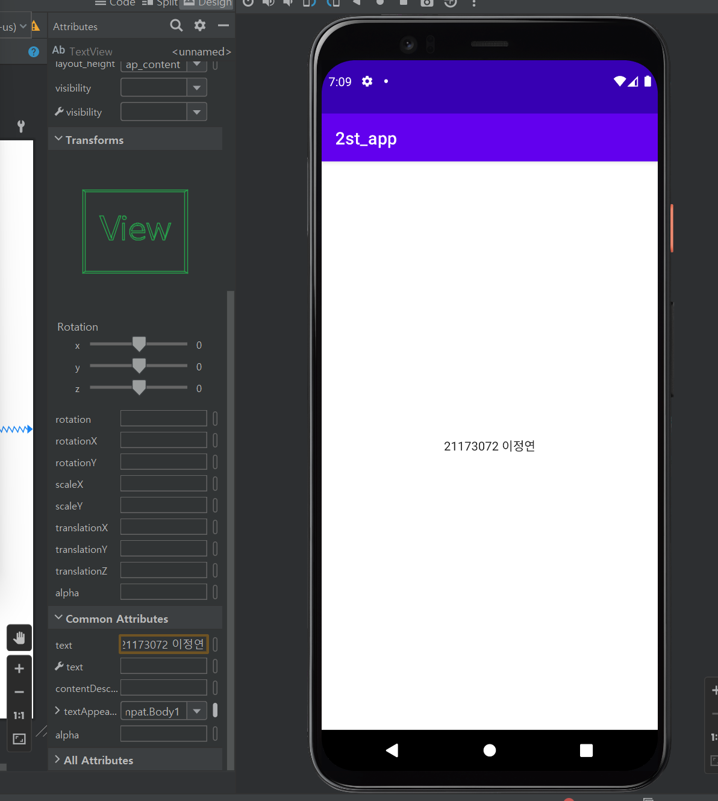</img>

# 3주차 (2022-03-22)
- 네이버링크,전화걸기,Toast메세지(학번) 만듬
- 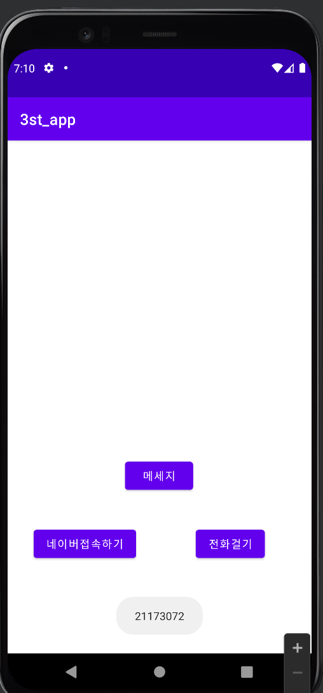</img>
- </img>
- 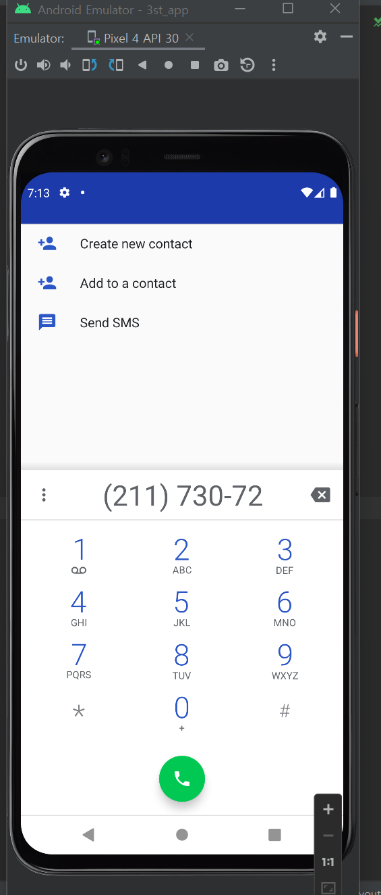</img>

# 5주차 (2022-04-05)
- 동적할당, 가이드라인, 이미지바꾸기
- 이미지 바꾸기 버튼 프로젝트

    : activity_main.xml 소스파일 캡처화면 첨부

    : Mainactivity.java 소파일 캡처화면 첨부

    : 실행 결과 캡처화면 2개
- 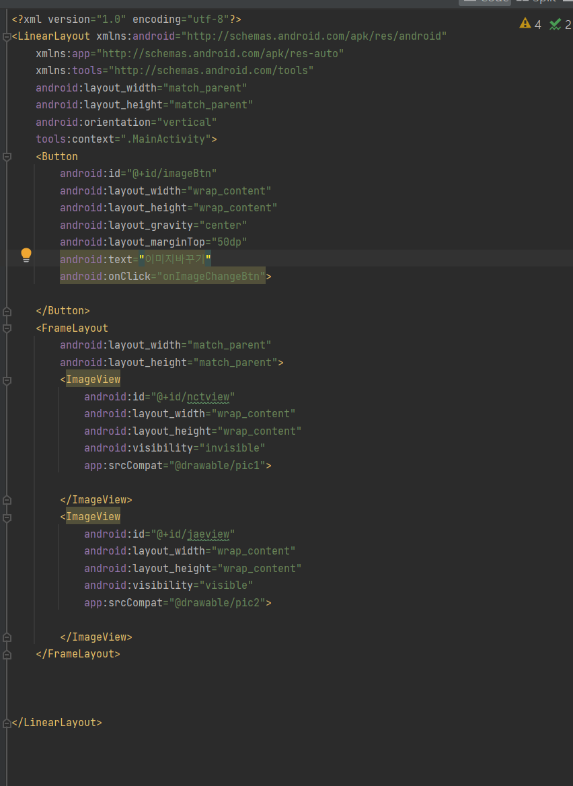</img>
- 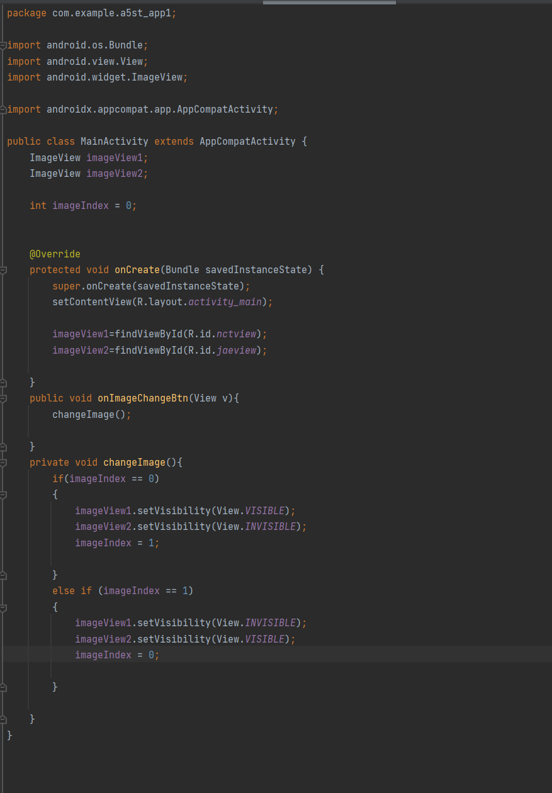</img>
- </img>
- </img>

# 6주차 (2022-04-16)
두개의 버튼을 추가 삽입 

• 한 개의 버튼을 클릭하면 

    1. Toast.makeText() 이용 하단에 width 크기 값을 표시 (Interger.toString() 함수 사용) 

• 또 다른 버튼을 클릭하면 

    2. Toast.makeText() 하단에 height 크기 값을 표시 (Interger.toString() 함수 사용)

- 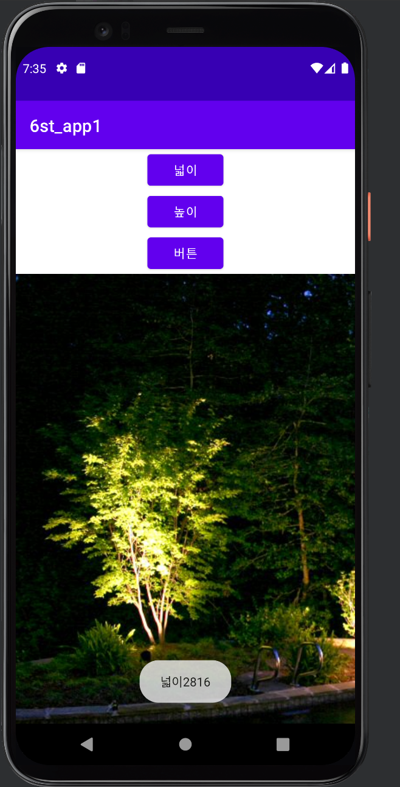</img>
- 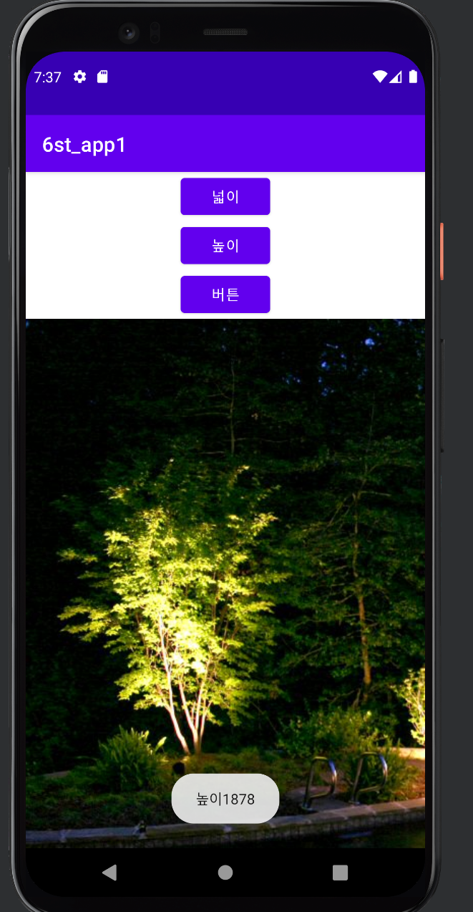</img>
- </img>
- </img>

 # 10주차 (2022-05-10)
안드로이드 앱 만들기 – 여러 화면 만들고 화면 간 전환하기
- 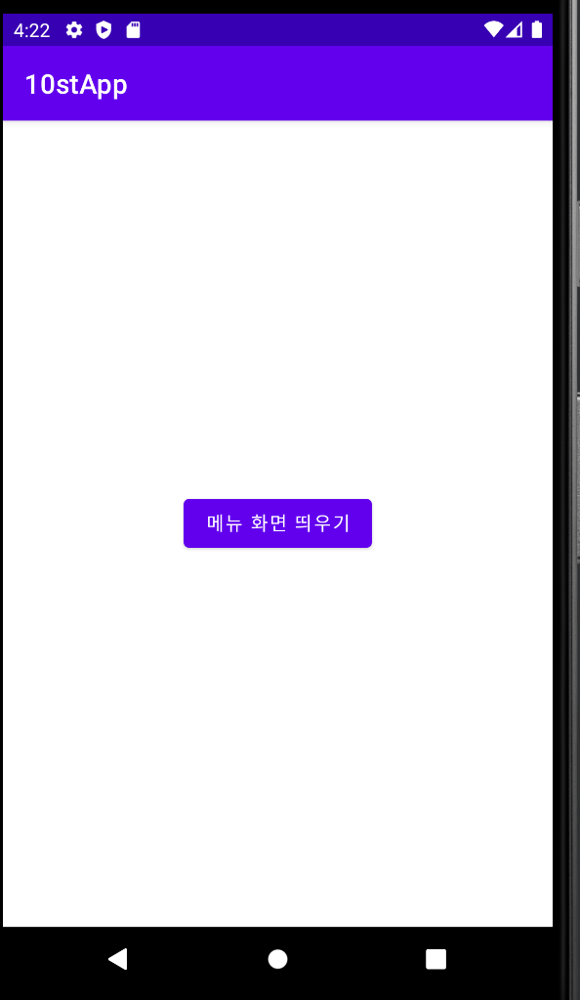</img>
- 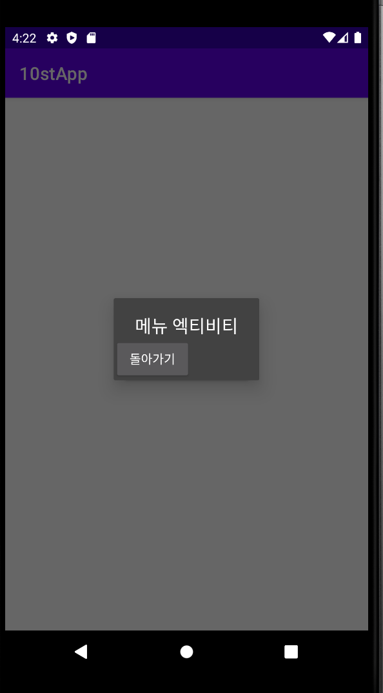</img>
- 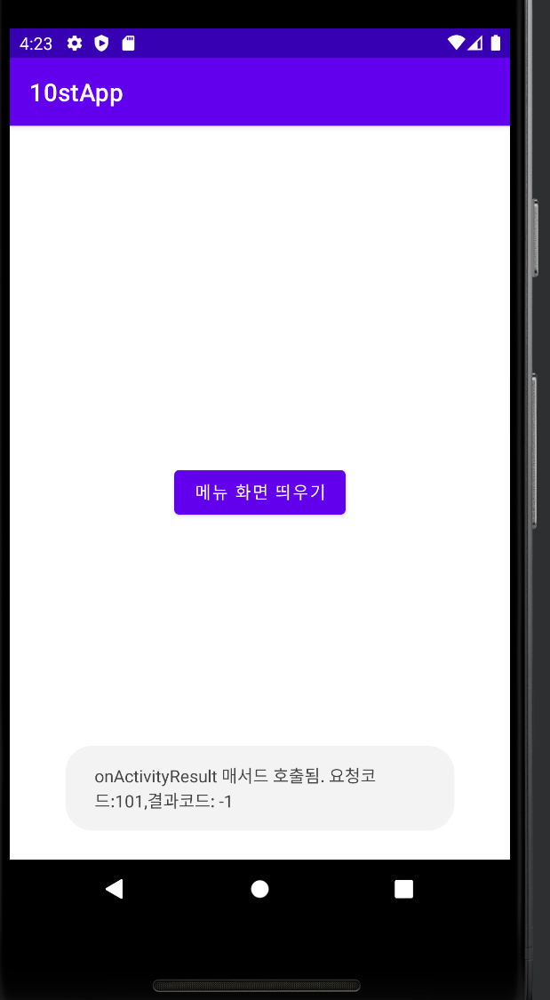</img>
- 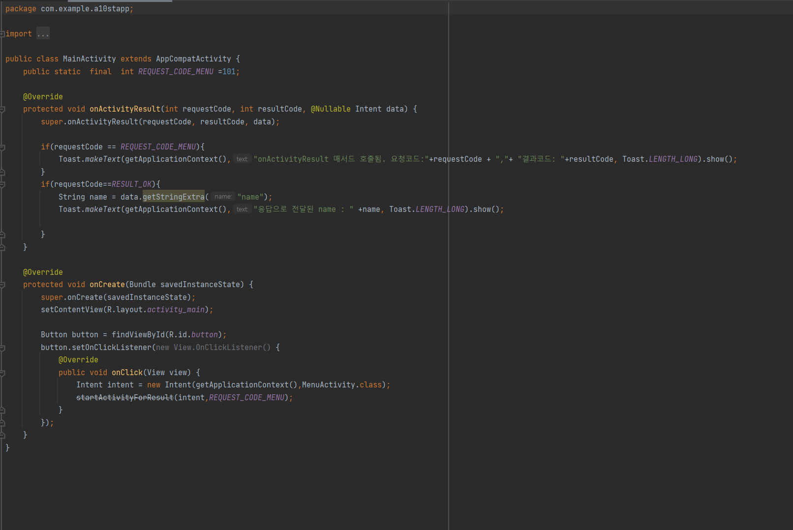</img>
- </img>
